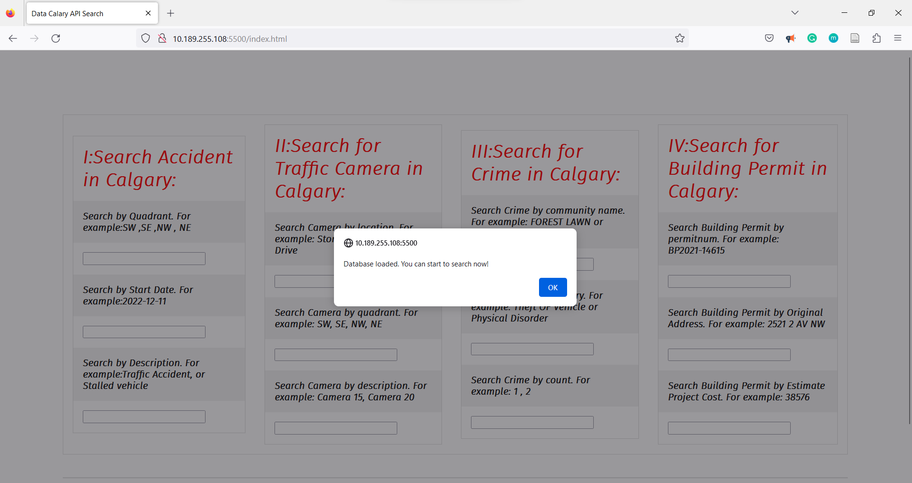
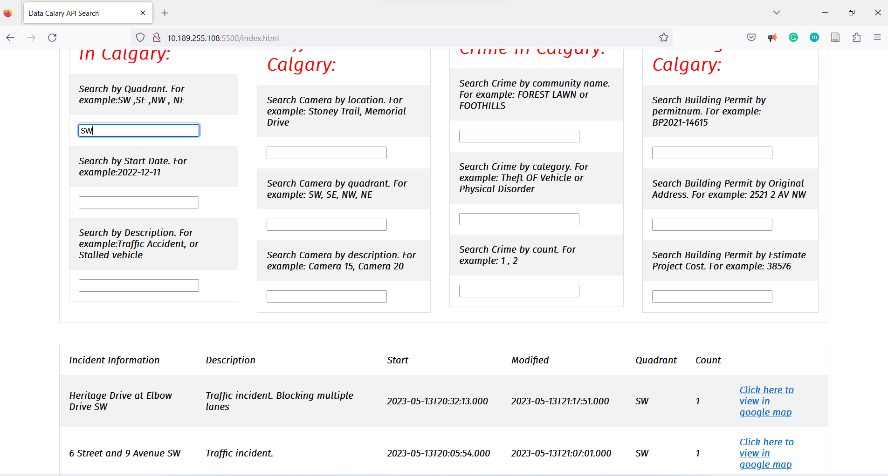
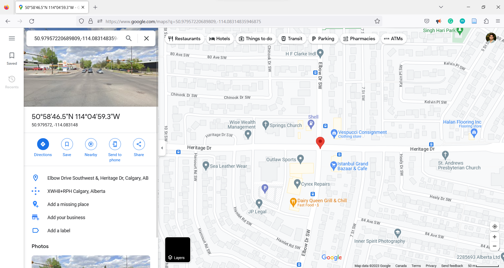

# Data Calgary API Search

Data Calgary API Search is a web-based application that allows users to search and analyze various datasets in Calgary, including crime statistics, traffic accidents, traffic cameras, and building permits. This project was completed in the Fall of 2022.

## Overview

This application provides an interactive interface for users to search and analyze various datasets in Calgary. The available datasets include crime statistics, traffic incidents, traffic cameras, and building permits.

## Features

- **Search traffic incidents** by quadrant, start date, and description.
- **Search traffic cameras** by location, quadrant, and description.
- **Search crimes** by community name, category, and count.
- **Search building permits** by permit number, original address, and estimated project cost.

## Technologies Used

- HTML
- CSS
- JavaScript

## Usage

1. Open the `index.html` file in your web browser.
2. Input your search terms in the appropriate fields.
3. The results will automatically populate as you type.

## HTML Structure

The HTML structure of the project consists of a table divided into four main sections: accidents, traffic cameras, crimes, and building permits. Each section contains various search fields. The search results are dynamically displayed in a separate table at the bottom of the page.

## Contributing

If you would like to contribute to the project, please submit pull requests. We recommend opening an issue first to discuss and coordinate your proposed changes.

## License

This project is released under the MIT license, which allows for open-source contributions and modifications.
